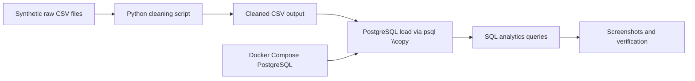

# Architecture Overview

## Flow

1. Raw CSVs are stored in `05_Source_Code/data/raw/`.
2. `clean_song_plays.py` removes duplicates, drops invalid rows, and standardizes text and date formats.
3. The cleaned file is written to `05_Source_Code/data/cleaned/`.
4. PostgreSQL is started locally with Docker.
5. Tables are created and data is loaded using `psql`.
6. SQL queries are executed for joins, aggregations, and window-function analysis.
